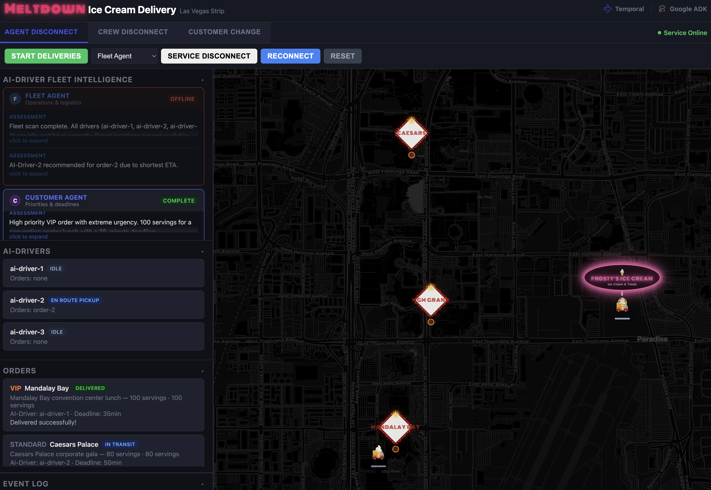

# Meltdown — Ice Cream Delivery Fleet Demo 

A conference demo showing **Google ADK** multi-agent reasoning with **Temporal** durable execution, visualized as an ice cream delivery fleet on the Las Vegas Strip.

<p align="center">
  
</p>

Orders auto-generate on a timer from Las Vegas Strip venues. **AI agents** (Fleet, Customer, Resolver) reason about each order — evaluating positions, capacity, and priority — then assign it to the best **delivery actor**. When things go wrong — delivery actor disconnects, agent failures, customer changes — Temporal ensures nothing is lost.

> **Terminology:** AI agents **reason** (LLM + tools, run inline via ADK). Delivery actors **execute** (child workflows that carry out routes). They are not Temporal workers.

## What It Demonstrates

| Scenario | What Happens | What It Shows |
|----------|-------------|---------------|
| **Tool Degradation** | Take Fleet Agent offline | Fleet Agent's tools fail fast (2 retries), error returned to LLM — Resolver assigns with Customer Agent data only. Reconnect → tools succeed → full assessment resumes. Temporal shows retry attempts in the UI. |
| **Service Disruption & Recovery** | Take a delivery actor offline mid-delivery | Delivery actor completes current delivery but can't report back. Temporal retries with backoff until reconnected. Stays at hotel on the map — no teleporting. Reconnect → next retry succeeds → navigates home for next order. |
| **Human-in-the-Loop (HITL)** | Submit an address change or cancellation mid-delivery | Workflow pauses on `wait_condition`, approves, signals delivery actor — reroutes mid-delivery to new destination. Cross-workflow coordination via signals. |

## Architecture

```
┌──────────────────────────────────┐
│         Temporal Server          │
│   (workflow state + replay)      │
└──────────┬───────────────────────┘
           │
     ┌─────┴─────────────────────────────────┐
     │                                       │
┌────▼─────────────────────────────────┐ ┌───▼──────────────────────────┐
│  Worker process (3 workers)          │ │  Server process              │
│                                      │ │  FastAPI + WebSocket         │
│  meltdown-workflows worker           │ │                              │
│  ├─ MeltdownDemoWorkflow (state)     │ │  Queries Temporal for state: │
│  │    ├─ owns driver positions,      │ │  ├─ MeltdownDemoWorkflow     │
│  │    │   order assignments          │ │  │   .get_status             │
│  │    ├─ builds DriverSnapshots      │ │  └─ DriverRouteWorkflow     │
│  │    ├─ _run_adk_assignment()       │ │      .get_status             │
│  │    │   inline (live mode)         │ │                              │
│  │    ├─ OrderGenerationWorkflow     │ │  Sends signals only:         │
│  │    │   child (timer + orders)     │ │  disconnect, reconnect,      │
│  │    └─ DriverRouteWorkflow x3      │ │  customer change, start      │
│  │        child workflows            │ │                              │
│  └─ DriverRouteWorkflow              │ │  No workers, no FleetState   │
│       ├─ owns disconnect state       │ └──────────────────────────────┘
│       │   (Temporal retry pattern)   │
│       ├─ tracks status, path_history,│
│       │   is_disconnected,           │
│       │   is_recovering,             │
│       │   current_orders             │
│       ├─ navigate_to() → DELIVERY    │
│       ├─ pickup_orders() → DELIVERY  │
│       ├─ deliver_order() → DELIVERY  │
│       └─ signals parent on complete  │
│                                      │
│  meltdown-delivery worker (max 20)   │
│  └─ navigation, pickup, deliver,     │
│     order generation, changes        │
│                                      │
│  meltdown-agents worker (max 5)      │
│  └─ ADK tool activities              │
│       (via TemporalModel):           │
│       ParallelAgent:                 │
│       ├─ Fleet Agent                 │
│       │   tool_get_fleet_status      │
│       │   tool_get_route_info (Maps) │
│       └─ Customer Agent              │
│           tool_get_order_priorities  │
│           google_search (grounding)  │
│       Resolver →                     │
│         tool_submit_assignment       │
│       TemporalModel(→AGENTS_QUEUE)   │
└──────────────────────────────────────┘
```

**How ADK and Temporal map to each other:**

| ADK concept | Temporal concept |
|-------------|-----------------|
| **LLM Agent** (`Agent` + `TemporalModel`) | Each Gemini call → `invoke_model` activity, recorded in event log |
| **Orchestrator Agent** (`SequentialAgent`, `ParallelAgent`) | Pure Python coordination — no Temporal activity, no LLM |
| **Tool call** (via `activity_tool`) | Each tool invocation → named Temporal activity, retryable + replayable |
| **Entire agent pipeline** | Runs inline in the workflow via `_run_adk_assignment()` (live); as a single activity `reason_about_assignment` (mock) |

Fleet Agent, Customer Agent, and Resolver are LLM Agents. The outer `order_assignment` pipeline is an Orchestrator Agent — it sequences them with no model of its own. Temporal never sees the orchestration logic; it only sees individual LLM calls and tool calls as discrete activities.

### Core mechanism — how ADK becomes durable

The entire demo hinges on two pieces of code working together:

**1. ADK Runner executes inside a Temporal workflow** (`workflows.py` → `_run_adk_assignment()`):

```python
runner = Runner(agent=agent, app_name="meltdown_demo", session_service=session_service)

async for event in runner.run_async(
    user_id="workflow", session_id=session.id,
    new_message=Content(parts=[Part(text=prompt)]),
):
    events_count += 1
```

A full multi-agent ADK pipeline (Fleet + Customer in parallel → Resolver) runs **inline inside a Temporal workflow**. Not as an external call — inside the workflow's execution context.

**2. `GoogleAdkPlugin` intercepts every LLM and tool call** (`worker.py` → agents worker):

```python
Worker(
    client, task_queue=AGENTS_QUEUE,
    activities=[register_assignment, tool_get_fleet_status, ...],
    plugins=[GoogleAdkPlugin()],
)
```

The plugin turns each Gemini inference and each tool invocation into a **separate Temporal activity** — recorded in the event log, retryable, and replayable. Without it, ADK agents are ephemeral Python; with it, every reasoning step has Temporal's durability guarantees. If the worker crashes mid-reasoning, the workflow replays from the event log and resumes exactly where it left off.

**Two processes**: `run.sh` starts a worker process and a server process (plus Temporal dev server). The server queries Temporal workflows for state (`_build_snapshot_from_queries()`) and sends signals only — no workers, no FleetState reads. Workers run three Temporal workers on three task queues.

**3-queue separation**: LLM calls are slow (3–5s). Without separate queues, assignment requests could starve navigation activities and cause heartbeat timeouts. The agents queue caps at 5 concurrent; delivery at 20. The workflows queue runs only workflows (no activities) — dedicated to replay. `GoogleAdkPlugin` is registered on **both** the workflow worker (sandbox passthroughs + deterministic runtime for replay) and the agents worker (`invoke_model` activity registration). `TemporalModel` uses `ActivityConfig(task_queue=AGENTS_QUEUE)` to route LLM calls to the agents worker.

### What each agent reasons about

| Agent | Reasoning | Tools |
|-------|-----------|-------|
| **Fleet Agent** (operational) | Delivery actor positions, capacity (free slots), ETAs to destination, disconnect status — excludes unavailable actors | `tool_get_fleet_status`, `tool_get_route_info` (Google Maps) |
| **Customer Agent** (priority) | VIP vs standard tier, deadline pressure, hotel events (conferences, galas), servings/guest count | `tool_get_order_priorities`, `google_search` (Gemini grounding) |
| **Resolver** (synthesis) | Weighs Fleet + Customer assessments, compensates if either agent is offline, picks final delivery actor | `tool_submit_assignment` |

Fleet and Customer run **in parallel** (`ParallelAgent`), then the Resolver runs **sequentially** after both complete (`SequentialAgent`). All tools are wrapped with `activity_tool()` — each call is a Temporal activity, recorded in the event log. If the worker restarts mid-call, results replay from the log.

> **Note:** Gemini's built-in `google_search` grounding normally can't be combined with custom function tools in the same request. ADK's `GoogleSearchTool(bypass_multi_tools_limit=True)` enables this — the Customer Agent uses Google Search alongside `tool_get_order_priorities` in a single agent, no sub-agent needed.

> **Agent disconnect resilience:** When Fleet Agent is disconnected, its tool activities (`tool_get_fleet_status`, `tool_get_route_info`) check FleetState and raise `RuntimeError`. Temporal retries (2 attempts, fast backoff via `_FLEET_TOOL_RETRY`). The `_activity_tool.py` wrapper catches the exhausted retry and returns an error string to the LLM — the agent reasons about the failure, and the Resolver assigns based on Customer Agent data alone. No pipeline crash.

### Mock mode

Mock mode is completely separate from live code. The `agent_fleet/mock/` folder contains its own `activities.py` and `worker.py`. The decision happens once at startup in `worker.py`: if `GOOGLE_API_KEY` is set, live workers run (with `GoogleAdkPlugin`, ADK inline in workflows); if not, mock workers from `agent_fleet/mock/worker.py` run instead. Live code has zero mock awareness — no `MOCK_MODE` flag, no `_get_api_activities()`, no per-key fallback selection. Mock activities use `@activity.defn(name=...)` overrides to match live activity names so workflows don't know or care which version is running. Real activities let failures propagate to Temporal's retry mechanism.

## Prerequisites

- Python 3.11+
- [Temporal CLI](https://docs.temporal.io/cli) (`brew install temporal`)
- Google Gemini API key (`GOOGLE_API_KEY`) — required for live mode; without it the entire demo runs in mock mode. Restricted to **Generative Language API**.
- Google Maps API key (`GOOGLE_MAPS_API_KEY`) — used for route polylines and ETAs. Restricted to **Directions API**. This must be a separate key from `GOOGLE_API_KEY` because the Generative Language API cannot share a key with standard Google Cloud APIs.

The startup decision is binary: `GOOGLE_API_KEY` set → live workers (ADK + all API activities), not set → mock workers (deterministic data, no LLM calls). Default model is `gemini-2.5-flash` (override with `DEFAULT_MODEL` env var).

## Quick Start

### 1. Install and configure

```bash
pip install -e ".[dev]"
echo 'export GOOGLE_API_KEY="your-gemini-key"' > .env
echo 'export GOOGLE_MAPS_API_KEY="your-maps-key"' >> .env  # optional, must be Maps-enabled
```

### 2. Run

```bash
./run.sh    # starts Temporal dev server + worker process + server process
```

### 3. Open the dashboard

| Interface | URL |
|-----------|-----|
| **Demo dashboard** | http://localhost:8080 |
| **Temporal UI** (workflow history, event log) | http://localhost:8233 |

## Demo Flow

1. **Start Deliveries** — Orders auto-generate every 15s. AI agents reason per-order and assign to the best delivery actor. Delivery actors continuously pick up from Frosty's Ice Cream and deliver.
2. **Demo 1: Tool Degradation** — Take Fleet Agent offline → tools fail fast (2 retries) → error returned to LLM → Resolver assigns with Customer Agent data → reconnect → full reasoning resumes
3. **Demo 2: Service Disruption & Recovery** — Select a delivery actor → disconnect → finishes delivery, stays at hotel, can't report → Temporal retries with backoff → reconnect → next retry succeeds → navigates home
4. **Demo 3: Human-in-the-Loop (HITL)** — Pick an active order → submit address change → workflow pauses for approval → approve → delivery actor reroutes mid-delivery to new destination

## Key Files

| File | What it does |
|------|-------------|
| `agent_fleet/models.py` | Dataclass models for all Temporal payloads (incl. `DriverSnapshot`) |
| `agent_fleet/simulation.py` | FleetState — SQLite WAL-backed write-only UI projection (`fleet_state.db`, cross-process; used by mock activities only) |
| `agent_fleet/activities.py` | Temporal activities — navigation, delivery, Maps API, agent tools |
| `agent_fleet/workflows.py` | Temporal workflows — owns driver state, signals, queries, Temporal-native retry for disconnect. Includes `OrderGenerationWorkflow` |
| `agent_fleet/agents.py` | ADK agent composition — Fleet, Customer, Assignment Resolver |
| `agent_fleet/config.py` | Centralized env config — `GOOGLE_API_KEY`, `GOOGLE_MAPS_API_KEY`, `DEFAULT_MODEL`, `TEMPORAL_ADDRESS` |
| `agent_fleet/queues.py` | Task queue name constants (workflows / delivery / agents) |
| `agent_fleet/worker.py` | Three Temporal workers — workflow-only, delivery, agents. Live/mock decision at startup |
| `agent_fleet/mock/` | Self-contained mock mode — `activities.py` (deterministic mocks with `name=` overrides) and `worker.py` (3 workers, no GoogleAdkPlugin) |
| `agent_fleet/server.py` | FastAPI server — queries Temporal for state, signal-only API, WebSocket, frontend |
| `agent_fleet/locations.py` | Las Vegas Strip venue pool and random order generation |
| `frontend/index.html` | Single-file SPA — Leaflet map, agent panels, overlays |

## Commands

```bash
make lint    # ruff check + format check
make fmt     # ruff format (write)
make test    # pytest
make run     # start the demo
```
