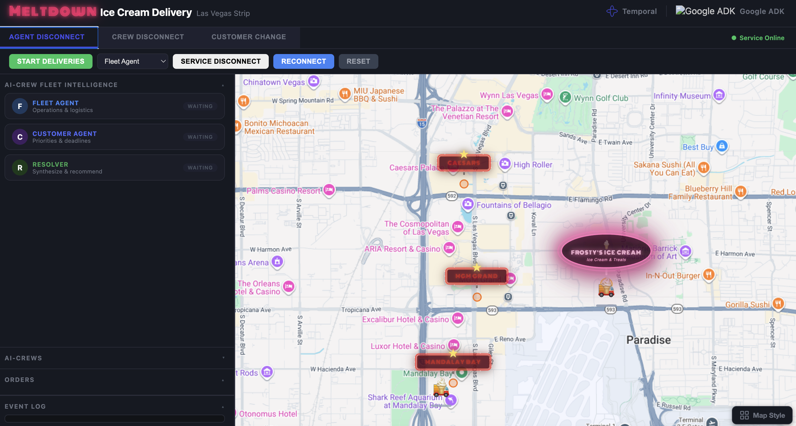

<p align="center">
  
</p>

# Meltdown — Ice Cream Delivery Fleet Demo

A conference demo showing **Google ADK** multi-agent reasoning with **Temporal** durable execution, visualized as an ice cream delivery fleet on the Las Vegas Strip.

<!-- TODO: record walkthrough video and embed here -->
<!-- TODO: verify font sizes are legible on large conference screen before presenting -->

<p align="center">
  
</p>

Orders auto-generate on a timer from Las Vegas Strip venues. AI agents reason about each order — evaluating driver positions, capacity, and priority — then assign it to the best driver. When things go wrong — driver disconnects, agent failures, customer changes — Temporal ensures nothing is lost.

## What It Demonstrates

| Scenario | What Happens | What It Shows |
|----------|-------------|---------------|
| **Agent Disconnect** | Take an agent offline mid-reasoning | ADK degrades gracefully — Resolver compensates with available data. Temporal records every step that completed. Two resilience layers. |
| **Driver Disconnect** | Take a single AI-Driver offline mid-delivery | Workflow cancels the running activity via cancellation scope, waits for reconnect signal, resumes. Everything flows through Temporal — API just sends signals. |
| **Customer Change** | Submit an address change or cancellation | Human-in-the-loop: workflow pauses on `wait_condition`, resumes immediately on signal — no polling, no timeout |

## Architecture

```
┌──────────────────────────────────┐
│         Temporal Server          │
│   (workflow state + replay)      │
└──────────┬───────────────────────┘
           │
┌──────────▼────────────────────────────────────────────┐
│  Python process (3 workers)                           │
│                                                       │
│  meltdown-workflows worker (workflows only, no acts)  │
│  ├─ MeltdownDemoWorkflow  (source of truth for state) │
│  │    ├─ owns driver positions, order assignments      │
│  │    ├─ builds DriverSnapshots → passes to activities│
│  │    ├─ reason_about_assignment() → AGENTS queue     │
│  │    └─ DriverRouteWorkflow x3   child workflows     │
│  └─ DriverRouteWorkflow                               │
│       ├─ owns disconnect state + cancellation scopes  │
│       ├─ navigate_to()  → DELIVERY queue (heartbeats) │
│       ├─ pickup_orders() → DELIVERY queue             │
│       ├─ deliver_order() → DELIVERY queue             │
│       └─ signals parent on delivery complete          │
│                                                       │
│  meltdown-delivery worker (max 20 concurrent)         │
│  └─ navigation, pickup, deliver, state sync, changes  │
│                                                       │
│  meltdown-agents worker (max 5 concurrent)            │
│  └─ ADK assignment pipeline (via TemporalModel)       │
│       ParallelAgent:                                  │
│       ├─ Fleet Agent    tool_get_fleet_status         │
│       │                 tool_get_route_info (Maps)    │
│       └─ Customer Agent tool_get_order_priorities     │
│                         tool_search_hotel_context     │
│       Assignment Resolver → tool_submit_assignment    │
│       TemporalModel(activity_config→AGENTS_QUEUE)     │
│                                                       │
│  FleetState singleton (UI projection only)            │
│  └─ activities write here for frontend WebSocket      │
│     workflows and activities never read it for logic  │
└───────────────────────────────────────────────────────┘
           │
┌──────────▼───────────────────────┐
│     FastAPI + WebSocket          │
│     └─ Frontend (Leaflet map)    │
└──────────────────────────────────┘
```

**How ADK and Temporal map to each other:**

| ADK concept | Temporal concept |
|-------------|-----------------|
| **LLM Agent** (`Agent` + `TemporalModel`) | Each Gemini call → `invoke_model` activity, recorded in event log |
| **Orchestrator Agent** (`SequentialAgent`, `ParallelAgent`) | Pure Python coordination — no Temporal activity, no LLM |
| **Tool call** (via `activity_tool`) | Each tool invocation → named Temporal activity, retryable + replayable |
| **Entire agent pipeline** | Runs inside one Temporal activity (`reason_about_assignment`) |

Fleet Agent, Customer Agent, and Resolver are LLM Agents. The outer `order_assignment` pipeline is an Orchestrator Agent — it sequences them with no model of its own. Temporal never sees the orchestration logic; it only sees individual LLM calls and tool calls as discrete activities.

**3-queue separation**: LLM calls are slow (3–5s). Without separate queues, assignment requests could starve navigation activities and cause heartbeat timeouts. The agents queue caps at 5 concurrent; delivery at 20. The workflows queue runs only workflows (no activities) — dedicated to replay. `GoogleAdkPlugin` is registered on **both** the workflow worker (sandbox passthroughs + deterministic runtime for replay) and the agents worker (`invoke_model` activity registration). `TemporalModel` uses `ActivityConfig(task_queue=AGENTS_QUEUE)` to route LLM calls to the agents worker. All three workers run in the same process; `FleetState` is a write-only UI projection that activities update for the frontend WebSocket.

### What each agent reasons about

| Agent | Reasoning | Tools |
|-------|-----------|-------|
| **Fleet Agent** (operational) | Driver positions, capacity (free slots), ETAs to destination, disconnect status — excludes unavailable drivers | `tool_get_fleet_status`, `tool_get_route_info` (Google Maps) |
| **Customer Agent** (priority) | VIP vs standard tier, deadline pressure, hotel events (conferences, galas), servings/guest count | `tool_get_order_priorities`, `tool_search_hotel_context` (Google Search) |
| **Resolver** (synthesis) | Weighs Fleet + Customer assessments, compensates if either agent is offline, picks final driver | `tool_submit_assignment`, `tool_publish_agent_event` |

Fleet and Customer run **in parallel** (`ParallelAgent`), then the Resolver runs **sequentially** after both complete (`SequentialAgent`). All tools are wrapped with `activity_tool()` — each call is a Temporal activity, recorded in the event log. If the worker restarts mid-call, results replay from the log.

### Mock mode

Each API-backed activity checks its own key independently at worker startup. Maps activities need `GOOGLE_MAPS_API_KEY`, search needs both `GOOGLE_API_KEY` and `GOOGLE_CSE_ID`. Missing keys get per-service mock fallbacks from `mock_activities.py` — same Temporal activity names, deterministic data. ADK agents (`MOCK_MODE`) key off `GOOGLE_API_KEY` only. The startup log shows per-service status (e.g., `ADK=LIVE, Maps=MOCK, Search=LIVE`). Real activities let failures propagate to Temporal's retry mechanism.

## Prerequisites

- Python 3.11+
- [Temporal CLI](https://docs.temporal.io/cli) (`brew install temporal`)
- Google Gemini API key (for ADK agents; falls back to mock mode without it)
- Google Maps API key (optional, must be a Maps-enabled key — falls back to mock route data)
- Google Custom Search Engine ID (optional — falls back to curated hotel data)

Each API key is checked independently. Without `GOOGLE_API_KEY`, ADK agents run in mock mode. Without `GOOGLE_MAPS_API_KEY`, route activities use mock data. Without `GOOGLE_CSE_ID`, hotel search uses curated context. You can run with any combination — the startup log shows which services are live vs mock.

## Quick Start

### 1. Install and configure

```bash
pip install -e ".[dev]"
echo 'export GOOGLE_API_KEY="your-gemini-key"' > .env
echo 'export GOOGLE_MAPS_API_KEY="your-maps-key"' >> .env  # optional, must be Maps-enabled
echo 'export GOOGLE_CSE_ID="your-cse-id"' >> .env  # optional
```

### 2. Run

```bash
./run.sh    # starts Temporal dev server + FastAPI app
```

### 3. Open the dashboard

| Interface | URL |
|-----------|-----|
| **Demo dashboard** | http://localhost:8080 |
| **Temporal UI** (workflow history, event log) | http://localhost:8233 |

## Demo Flow

1. **Start Deliveries** — Orders auto-generate every 15s. AI agents reason per-order (Fleet Agent checks positions/capacity, Customer Agent evaluates priority) and assign to the best driver. Drivers continuously pick up from Frosty's Ice Cream and deliver.
2. **Driver Disconnect** — Select an AI-Driver → disconnect signal → workflow cancels activity → reconnect signal → seamless resume. Everything flows through Temporal.
3. **Agent Disconnect** — Take an agent offline → Resolver compensates with available data → reconnect → full reasoning resumes
4. **Customer Change** — Submit a change → workflow pauses waiting for approval → approve/reject → order updated or discarded

## Key Files

| File | What it does |
|------|-------------|
| `agent_fleet/models.py` | Dataclass models for all Temporal payloads (incl. `DriverSnapshot`) |
| `agent_fleet/simulation.py` | FleetState — UI projection only (activities write, nothing reads for logic) |
| `agent_fleet/activities.py` | Temporal activities — navigation, delivery, Maps API, state sync, agent tools |
| `agent_fleet/mock_activities.py` | Mock activity implementations — registered in mock mode, same activity names |
| `agent_fleet/workflows.py` | Temporal workflows — owns driver state, cancellation scopes, signals, queries |
| `agent_fleet/agents.py` | ADK agent composition — Fleet, Customer, Assignment Resolver |
| `agent_fleet/config.py` | Centralized env config — API keys, model name, Temporal address, mock mode |
| `agent_fleet/queues.py` | Task queue name constants (workflows / delivery / agents) |
| `agent_fleet/worker.py` | Three Temporal workers — workflow-only, delivery, agents |
| `agent_fleet/server.py` | FastAPI server — signal-only API, WebSocket, frontend |
| `agent_fleet/locations.py` | Las Vegas Strip venue pool and random order generation |
| `frontend/index.html` | Single-file SPA — Leaflet map, agent panels, overlays |

## Commands

```bash
make lint    # ruff check + format check
make fmt     # ruff format (write)
make test    # pytest
make run     # start the demo
```
