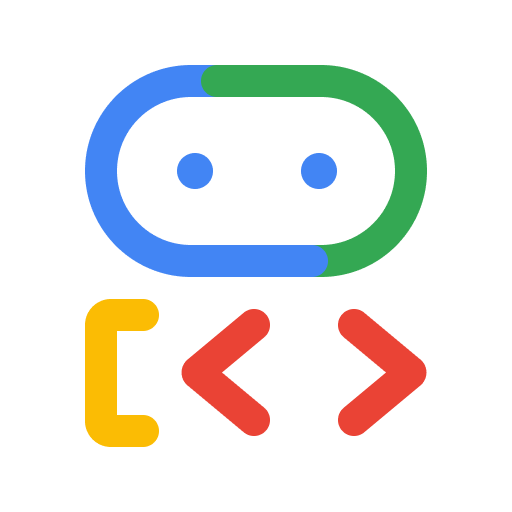
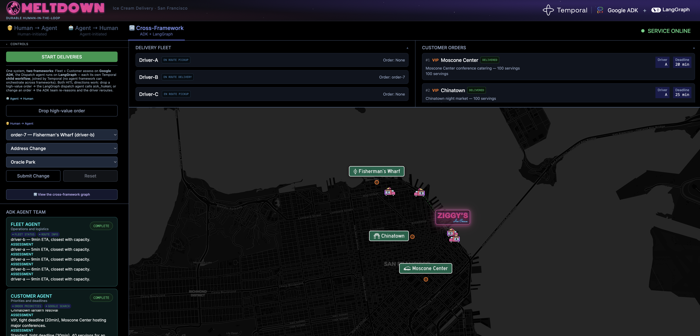
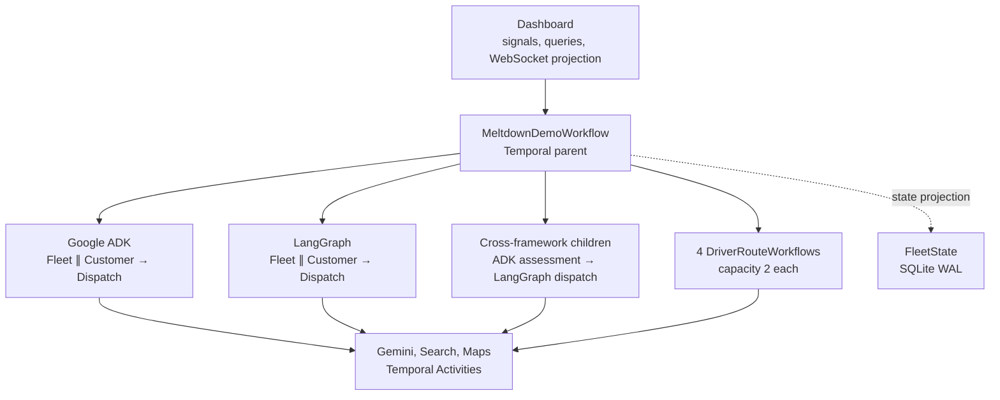
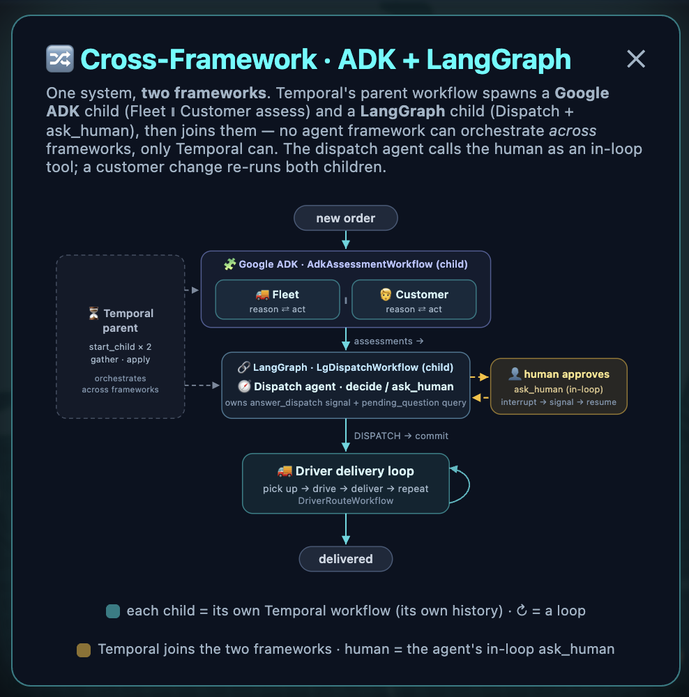

<div align="center">


&nbsp;&nbsp;·&nbsp;&nbsp;
<picture>
  <source media="(prefers-color-scheme: dark)" srcset="frontend/img/langgraph-logo.svg">
  
</picture>
&nbsp;&nbsp;·&nbsp;&nbsp;
<picture>
  <source media="(prefers-color-scheme: dark)" srcset="frontend/img/temporal_logo.svg">
  
</picture>

</div>

# Durable Human-in-the-Loop Agents 🍦

**A visual Python demo of two durable human-in-the-loop patterns: a human changes
an agent's work, and an agent asks a human for judgment.**

Ziggy's Ice Cream runs a four-driver delivery fleet in downtown San Francisco.
Google ADK and LangGraph own the agent loops. Temporal sits underneath them as
the durable-execution runtime, preserving agent calls, delivery progress, human
waits, and cross-framework handoffs when a Worker disappears.

This repository accompanies the AI Engineer World's Fair talk
[*The Human Is an Async API: Designing Durable Human-in-the-Loop Agents*](aie-world-fair-slides.pdf)
and the Temporal article
[*Durable, flexible multi-agent systems*](https://temporal.io/blog/durable-flexible-multi-agent-systems).

<p align="center">
  
</p>

## See the idea in 30 seconds

| Pattern | Who starts it? | What pauses? | What resumes it? |
| --- | --- | --- | --- |
| **Human → Agent** | A customer changes an active order | The driver waits at the venue | A supervisor's approval signal; ADK re-reasons an approved address change |
| **Agent → Human** | A LangGraph agent calls `ask_human` mid-loop | The agent graph and its Temporal Workflow wait | A human answer signal returned as the agent's next observation |
| **Cross-framework** | One order moves from ADK assessment to LangGraph dispatch | Either human interaction can wait durably | Temporal joins both framework children and applies the result |

<p align="center">
  <a href="https://youtu.be/kTPDzsXxKFg">
    
  </a>
  <br>
  <em>▶ <a href="https://youtu.be/kTPDzsXxKFg">Watch the demo</a></em>
</p>

## The boundary that matters

> **Frameworks own the loop—ADK and LangGraph. Temporal is the
> durable-execution runtime beneath them, and the only layer coordinating
> across them.**

| Layer | Owns |
| --- | --- |
| **Google ADK / LangGraph** | Observe → reason → act, agent abstractions, and tool selection |
| **Temporal** | Workflow state, retries, replay, Signals, durable waits, and child-workflow coordination |
| **FleetState (SQLite)** | A cross-process projection for the dashboard—not orchestration state |
| **Google APIs** | Gemini reasoning, Search grounding, route data, and ETAs |

Temporal does not replace the agent loop. In this demo, LangGraph's checkpointer
is intentionally `InMemorySaver`; Temporal event history is what makes the
suspended work survive a Worker restart.

## Two patterns, three use cases

The dashboard has three tabs. The third combines the first two patterns; it is
not a third HITL pattern.

| Tab | Framework path | Story |
| --- | --- | --- |
| **Human → Agent** | Google ADK | A customer submits a cancel or address change. The driver holds. On approval, the ADK team re-reasons an address change before the driver reroutes. |
| **Agent → Human** | LangGraph | A high-value order makes an agent call `ask_human`. LangGraph interrupts the loop; Temporal preserves the wait; the answer returns to the loop. |
| **Cross-Framework** | ADK child → LangGraph child | ADK assesses, LangGraph dispatches, and the Temporal parent applies the decision to the driver Workflow. Both HITL directions remain available. |

All three use cases share the same operating rule: agent children **decide**,
the parent Workflow **applies**, and driver Workflows **execute**.

## The durable primitives

Both directions reduce to the same Temporal mechanism: a Signal changes
Workflow state, and `wait_condition` resumes when that state is ready.

### Human → Agent

```python
@workflow.signal
async def update_pending(self, change: OrderUpdateInput) -> None:
    self._pending_holds.setdefault(change.order_id, PendingHold())

await workflow.wait_condition(
    lambda: self._pending_holds[order.order_id].decision is not None or self._stop
)

@workflow.signal
async def resolve_update(self, change: OrderUpdateInput) -> None:
    self._pending_holds[change.order_id].decision = change.change_type
```

The signal begins outside the agent. Approval releases the held delivery; an
approved address change also runs the ADK team again with the new destination.

### Agent → Human

```python
answer = interrupt({"question": question, "order_id": state["order_id"]})

self._pending_dispatch[order_id] = interrupt_payload
await workflow.wait_condition(lambda: order_id in self._dispatch_answers)

answer = self._dispatch_answers.pop(order_id)
result = await graph.ainvoke(Command(resume=answer), config=config)
```

Here the model calls `ask_human`. LangGraph supplies the interrupt/resume
plumbing; Temporal owns the durable wait for the answer Signal.

For the complete implementation path, replay behavior, activity boundaries,
and cross-framework child contracts, read [How it works](HOW_IT_WORKS.md).

## Architecture


```mermaid
flowchart TB
    UI["Dashboard<br/>signals, queries, WebSocket projection"] --> P["MeltdownDemoWorkflow<br/>Temporal parent"]
    P --> A["Google ADK<br/>Fleet ∥ Customer → Dispatch"]
    P --> L["LangGraph<br/>Fleet ∥ Customer → Dispatch"]
    P --> X["Cross-framework children<br/>ADK assessment → LangGraph dispatch"]
    P --> D["4 DriverRouteWorkflows<br/>capacity 2 each"]
    A --> G["Gemini, Search, Maps<br/>Temporal Activities"]
    L --> G
    X --> G
    D --> G
    P -. "state projection" .-> DB["FleetState<br/>SQLite WAL"]
```

The Worker process polls three Task Queues:

- `meltdown-workflows` for orchestration, replay, LangGraph nodes, and small
  projection activities.
- `meltdown-delivery` for navigation, pickup, delivery, and customer changes.
- `meltdown-agents` for ADK model and tool calls, limited to five concurrent
  Activities.

The cross-framework tab makes the handoff explicit:

<p align="center">
  
</p>

## Run the demo

### Prerequisites

- Python 3.11 or newer
- [uv](https://docs.astral.sh/uv/)
- [Temporal CLI](https://docs.temporal.io/cli)
- `GOOGLE_API_KEY`, restricted to the Gemini API
- `GOOGLE_MAPS_API_KEY`, restricted to the Directions API

The two Google keys must be separate. This is a live-model demo; there is no
mock mode.

### Quickstart

```bash
git clone https://github.com/temporal-community/durable-hitl-agents.git
cd durable-hitl-agents
cp .env.example .env
```

Replace both placeholders in `.env`, then run:

```bash
./run.sh
```

The script installs the locked dependencies, starts a local Temporal dev
server, starts the three Workers and FastAPI server, waits for readiness, and
shuts down only the processes it created.

| Interface | URL |
| --- | --- |
| Demo dashboard | <http://localhost:8080> |
| Temporal UI | <http://localhost:8233> |

Create a Gemini key in [Google AI Studio](https://aistudio.google.com/api-keys).
For Maps, enable the
[Directions API](https://console.cloud.google.com/apis/library/directions-backend.googleapis.com)
and create a separately restricted credential.

## Run the story

1. Select a tab and choose **Start Deliveries**. Orders begin at Ziggy's in the
   Ferry Building; four drivers batch up to two orders each.
2. On **Human → Agent**, select an active order and submit an address change or
   cancellation. The driver waits at the venue while a supervisor decides.
3. On **Agent → Human**, choose **Drop high-value order**. The agent calls
   `ask_human`, and the approval card appears while the Workflow is parked.
4. On **Cross-Framework**, inspect the `assess-<order-id>` ADK child and
   `dispatch-<order-id>` LangGraph child in the Temporal UI.

To show the durability moment, stop the Worker while an approval is pending,
then start it again from a second terminal:

```bash
make kill-worker
make worker
```

The question and delivery progress remain in Temporal. The replacement Worker
replays the history and returns to the same wait.

For timed stage cues and reset instructions, use the
[demo delivery guide](DEMO_GUIDE.md).

## Develop and test

```bash
uv sync --all-extras --frozen
make lint
make test
```

The test suite runs without Google keys and covers activity behavior, the
SQLite projection, API request contracts, Worker startup validation, Temporal
Signals and waits, per-order holds, cancellation races, and continue-as-new.

## Repository map

| Path | Role |
| --- | --- |
| `agent_fleet/workflows.py` | Parent, driver, order-generation, and cross-framework child Workflows |
| `agent_fleet/agents.py` | Google ADK Fleet, Customer, and Dispatch team |
| `agent_fleet/langgraph_agents.py` | LangGraph team, tools, `ask_human`, and graph routing |
| `agent_fleet/activities.py` | Delivery, Maps, Search, and agent-tool Activities |
| `agent_fleet/worker.py` | Three Task Queue Workers and plugin registration |
| `agent_fleet/server.py` | Signal/query API, WebSocket feed, and frontend hosting |
| `agent_fleet/simulation.py` | SQLite-backed dashboard projection |
| `frontend/` | Single-page fleet dashboard and visual assets |
| `HOW_IT_WORKS.md` | Detailed architecture and execution mechanics |
| `DEMO_GUIDE.md` | Talk track, demo flow, recovery beat, and reset steps |

## Acknowledgements

This demo was a team effort. With thanks to:

- [Alfred Chan](https://www.linkedin.com/in/alfredschan/) — visual design and UI assets.
- [Tim Conley](https://www.linkedin.com/in/tim-conley-0b249b14/) — Google ADK integration and review.
- [David Hyde](https://www.linkedin.com/in/dabh/) — LangGraph integration and review.
- [Maple Xu](https://www.linkedin.com/in/maple-xu/) — ADK event-history summaries.
- [Angie Byron](https://www.linkedin.com/in/webchick/) — documentation and review.
- [Josh Geller](https://www.linkedin.com/in/joshua-geller-913311191/) — video editing.
- [Cecil Phillip](https://www.linkedin.com/in/cecilphillip/) — ideation and review.

Adapted from the original **Meltdown** ice-cream delivery fleet demo.

## License

[MIT](LICENSE)
